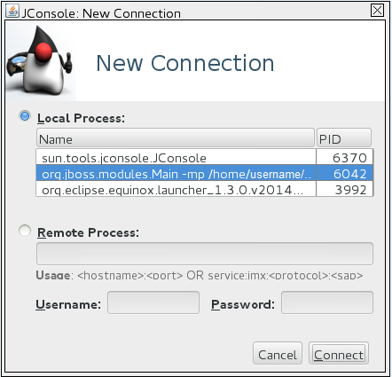

helloworld-mbean: Helloworld Using MBean and CDI component
======================================================
Author: Lagarde Jeremie  
Level: Intermediate  
Technologies: CDI, JMX, MBean  
Summary: Demonstrates the use of CDI 1.0 and MBean  
Target Product: EAP  
Product Versions: EAP 6.1, EAP 6.2, EAP 6.3, EAP 6.4  
Source: <https://github.com/jboss-developer/jboss-eap-quickstarts/>  

What is it?
-----------

This example demonstrates the use of *CDI 1.0* and *MBean* in  Red Hat JBoss Enterprise Application Platform. The project also includes a set of Aquillian tests for mbeans.

The example is composed of mbeans. They are as follows :

1. `AnnotatedComponentHelloWorld`: This mbean is a managed bean with '@MXBean' annotation.

1. `MXComponentHelloWorld`:  This mbean is a managed bean with 'MXBean' interface.

1. `MXPojoHelloWorld`:  This mbean is a pojo using MXBean interface and declared in jboss-service.xml.

1. `SarMXPojoHelloWorld`:  This mbean is a pojo using MXBean interface and declared in jboss-service.xml in Sar packaging.

System requirements
-------------------

The application this project produces is designed to be run on Red Hat JBoss Enterprise Application Platform 6.1 or later. 

All you need to build this project is Java 6.0 (Java SDK 1.6) or later, Maven 3.0 or later.

 
Configure Maven
---------------

If you have not yet done so, you must [Configure Maven](https://github.com/jboss-developer/jboss-developer-shared-resources/blob/master/guides/CONFIGURE_MAVEN.md#configure-maven-to-build-and-deploy-the-quickstarts) before testing the quickstarts.

Start the JBoss EAP Server
-------------------------

1. Open a command prompt and navigate to the root of the JBoss EAP directory.
2. The following shows the command line to start the server:

        For Linux:   EAP_HOME/bin/standalone.sh
        For Windows: EAP_HOME\bin\standalone.bat

 
Build and Deploy the Quickstart
-------------------------

_NOTE: The following build command assumes you have configured your Maven user settings. If you have not, you must include Maven setting arguments on the command line. See [Build and Deploy the Quickstarts](../README.md#buildanddeploy) for complete instructions and additional options._

1. Make sure you have started the JBoss EAP server as described above.
2. Open a command propmt and navigate to the root directory of this quickstart.
3. Type this command to build and deploy the archive:

        mvn clean jboss-as:deploy

4. This will deploy `helloworld-mbean-webapp\target\jboss-helloworld-mbean-webapp.war` and `helloworld-mbean-service\target\jboss-helloworld-mbean-service.sar` to the running instance of the server.

Access and Test the MBeans  
--------------------------
This quickstart differs from the other quickstarts in that it uses 'JConsole' to access and test the quickstart rather than access an URL in the browser. If you do access <http://localhost:8080/jboss-helloworld-mbean-webapp/>, you will see a screen shot image of the JConsole application,

The following sections describe how to use 'JConsole' to inspect and test the MBeans. 

Start JConsole
--------------

To connect to the JBoss EAP server using jconsole, open a command prompt and type the following command :

        For Linux:   JDK_HOME/bin/jconsole
        For Windows: JDK_HOME\bin\jconsole.exe

Select JBoss process and connect to it.

 
Test the MBeans in JConsole
---------------------------

You can use JConsole to inspect and use the MBeans :

1. Click on the MBeans tab.
2. Expand `quickstarts` in the left column of the console.
3. Under `quickstarts`, you see the 4 MBeans: `AnnotatedComponentHelloWorld`, `MXComponentHelloWorld`, `MXPojoHelloWorld`, and `SarMXPojoHelloWorld`
4. Expand each MBean and choose: `Operations` --> `sayHello`.
5. Type your name in the (p0 String ) input text box and click the `sayHello` button.
   * For the `AnnotatedComponentHelloWorld` and `MXComponentHelloWorld` examples, you will see a popup Window displaying `Hello <your name>!`.
   * For the `MXPojoHelloWorld` and `SarMXPojoHelloWorld` examples, you will see a popup Window displaying `Welcome <your name>!`.

Undeploy the Archive
--------------------

1. Make sure you have started the JBoss EAP server as described above.
2. Open a command prompt and navigate to the root directory of this quickstart.
3. When you are finished testing, type this command to undeploy the archive:

        mvn jboss-as:undeploy

Run the Quickstart in JBoss Developer Studio or Eclipse
-------------------------------------
You can also start the server and deploy the quickstarts or run the Arquillian tests from Eclipse using JBoss tools. For more information, see [Use JBoss Developer Studio or Eclipse to Run the Quickstarts](../README.md#useeclipse) 

Debug the Application
------------------------------------

If you want to debug the source code of any library in the project, run the following command to pull the source into your local repository. The IDE should then detect it.

        mvn dependency:sources

